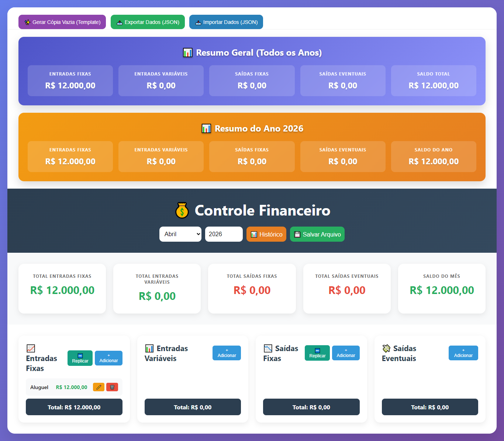

# Sistema Financeiro Pessoal

Este é um projeto simples em HTML, CSS e JavaScript que permite o controle financeiro pessoal, separando entradas e saídas em categorias fixas e variáveis/eventuais, com resumos mensais, anuais e gerais.

## Funcionalidades Principais

* **Lançamentos Detalhados:** Adição de entradas (fixas e variáveis) e despesas (fixas e eventuais).
* **Visualização Flexível:** Navegação por mês e ano.
* **Resumos Abrangentes:**
    * Resumo financeiro mensal detalhado (fixo/variável/eventual).
    * Resumo anual consolidado para o ano selecionado.
    * Resumo geral com o total acumulado de todos os anos registrados.
* **Histórico Completo:** Acesso fácil aos dados de meses anteriores.
* **Replicação Manual de Fixos:** Nas seções de "Entradas Fixas" e "Saídas Fixas", o botão **⏭️ Replicar** copia todos os lançamentos da categoria para o mês seguinte, ignorando itens que já existam (verificação por descrição). Um relatório é exibido ao final indicando quantos itens foram adicionados ou ignorados.
* **Portabilidade de Dados (Import/Export):**
    * **📤 Exportar Dados (JSON):** Gera um arquivo `.json` com todos os seus dados financeiros, útil para backup ou migração.
    * **📥 Importar Dados (JSON):** Carrega um arquivo `.json` exportado anteriormente. Oferece duas estratégias: **Mesclar** (preserva os dados existentes e adiciona apenas os novos) ou **Substituir** (substitui todos os dados pelo conteúdo importado).
* **Template Vazio:** Botão para gerar uma cópia limpa do arquivo HTML, ideal para compartilhar ou começar do zero.
* **Interface Moderna:** Design responsivo que se adapta a diferentes tamanhos de tela.
* **Independente:** Não requer servidor, banco de dados externo ou instalação. Funciona 100% offline no navegador.

## Como Funciona o Salvamento (Importante!)

Este sistema é um **arquivo HTML único e autônomo**:

1.  **Dados Embutidos:** Todas as suas informações financeiras (lançamentos, meses, anos) são salvas diretamente **dentro do código do próprio arquivo HTML** que você está usando.
2.  **Salvando Alterações:** Ao clicar no botão **💾 Salvar Arquivo**, o navegador fará o download de uma **nova versão** do arquivo `.html`.
3.  **Continuar Usando:** Este **novo arquivo baixado** contém todas as alterações que você fez. Para continuar de onde parou, você **DEVE ABRIR e USAR ESSE NOVO ARQUIVO** baixado. O arquivo antigo não terá as novas informações.

> **Resumindo:** Cada vez que salva, você cria uma nova "versão" do seu sistema com os dados atualizados. Sempre utilize o último arquivo baixado!

## Imagem da Tela

## Como Usar

1.  Salve o código HTML como um arquivo `Sistema Financeiro.html` (ou qualquer nome `.html`).
2.  Abra este arquivo no seu navegador de preferência.
3.  Comece a adicionar suas entradas e saídas nos meses desejados.
4.  Para replicar lançamentos fixos para o próximo mês, clique em **⏭️ Replicar** na seção desejada.
5.  **Sempre que fizer alterações importantes**, clique em **💾 Salvar Arquivo**.
6.  **Feche o arquivo antigo** e **abra o novo arquivo `.html`** que foi baixado para continuar.
7.  (Opcional) Use **📤 Exportar Dados (JSON)** para fazer backup dos seus dados, e **📥 Importar Dados (JSON)** para restaurá-los em qualquer cópia do sistema.
8.  (Opcional) Use o botão **✨ Gerar Cópia Vazia** para criar um template limpo para compartilhar.

## Tecnologias

* HTML5
* CSS3
* JavaScript Puro (Vanilla JS - sem bibliotecas ou frameworks externos)

---

Criado por [João Paulo](https://www.linkedin.com/in/joao-paul0/)
Repositório: [https://github.com/Joao-paulo19](https://github.com/Joao-paulo19)
