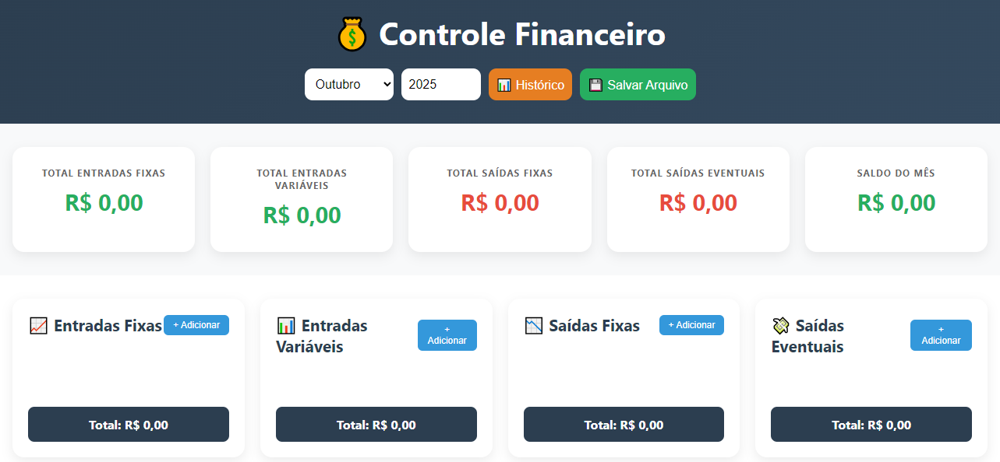

# Sistema Financeiro Pessoal

Este é um projeto simples em HTML, CSS e JavaScript que permite o controle financeiro pessoal, com entradas e saídas mensais/eventuais e resumo anual.

## Funcionalidades

- Adição de entradas e despesas
- Visualização por mês e ano
- Resumo financeiro mensal e anual
- Histórico de meses anteriores
- Interface responsiva e moderna
- **Não usa servidor nem banco de dados externo**

## Como funciona o salvamento

Este projeto é um **arquivo HTML independente**. Isso significa que:

- **Todos os dados são salvos dentro do próprio HTML**;
- Quando você clica em **Salvar Arquivo**, um novo arquivo `.html` será baixado;
- Este novo arquivo contém **todos os seus dados incorporados**;
- Para continuar usando o sistema com seus lançamentos salvos, **abra esse novo HTML baixado**.

> Ou seja: **você nunca precisa instalar nada ou usar banco de dados**. Basta abrir o HTML atualizado no navegador.

## Imagem de Exemplo

## Como usar

1. Baixe ou clone este repositório.
2. Abra o arquivo `index.html` no navegador.
3. Comece a usar normalmente.
4. Quando quiser salvar seu progresso, clique em **Salvar Arquivo**.
5. Um novo `.html` será gerado com seus dados — continue usando por ele.

## Tecnologias

- HTML5
- CSS3
- JavaScript Puro (sem bibliotecas externas)

---

Criado por [João Paulo](https://www.linkedin.com/in/joao-paul0/)  
Repositório: [https://github.com/Joao-paulo19](https://github.com/Joao-paulo19)
